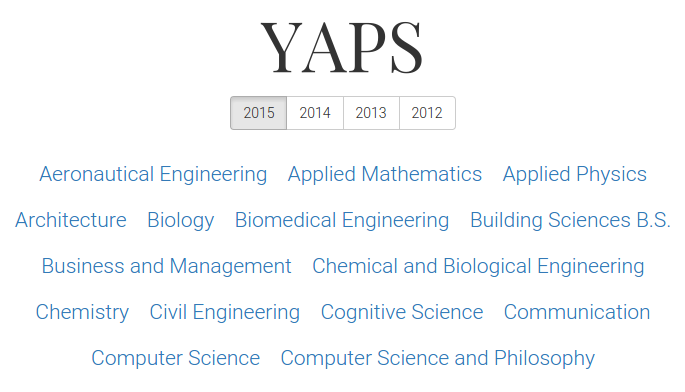

# YAPS
Simple degree scheduling


## Installation with vagrant
Get [vagrant](https://www.vagrantup.com/)
```sh
$ vagrant up
$ vagrant ssh
$ cd yaps
$ rake db:migrate
$ rake update_catalog
$ rails server -b 0.0.0.0
```
Get your browser to `localhost:3000` The project directory is synced with the vagrant virtual machine
